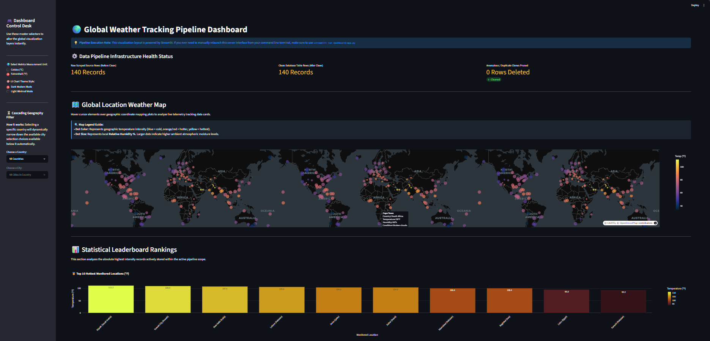

# 🌍 Global Weather Scraping & Interactive Dashboard Pipeline

This project is a complete, step-by-step **data pipeline** built completely from scratch using Python. 

Think of a data pipeline like a digital assembly line in a factory. It automatically grabs raw materials (weather data), cleans them up, stores them safely, and packages them into a beautiful, interactive website for anyone to use!

$$\text{1. Collect Data (Selenium)} \longrightarrow \text{2. Clean Data (Pandas)} \longrightarrow \text{3. Store Data (SQLite)} \longrightarrow \text{4. Display Data (Streamlit)}$$

---

# 📋 System Capabilities & Architecture Matrix

This platform is engineered using production-grade data principles to ensure reliable delivery, data integrity, and a seamless user experience. For stakeholders tracking specific design criteria or developers exploring the system, this matrix details the real-world features of the app and where they live in the source code:

| System Capability | Real-World Feature & User Benefit | Code Location & Mechanism |
| :--- | :--- | :--- |
| 🛰️ **Automated Data Harvesting** | Automatically collects live, real-world atmospheric records from the web without human intervention. | Powered by **Selenium** inside `scraper/scrape_data.py` |
| 🛡️ **System Resilience & Stability** | Uses intelligent network waits to handle slow webpage loads safely, running invisibly in the background so it never interrupts the user or crashes. | Implemented via explicit wait triggers and headless background execution |
| 📜 **Data Auditing & Backup Logs** | Captures an exact, unedited historical record of everything scraped, allowing developers to audit raw source information anytime. | Emits pristine raw data chunks straight to `data/raw_data.csv` |
| ⚡ **Network & Bandwidth Optimization** | Remembers previously visited web tracks during a live session, saving computer processing power and protecting public web servers from overload. | Automated target deduplication built into the web crawler loop |
| 🏗️ **Data Quality Control** | Loads raw text records into a structured framework to scrub anomalies and ensure only high-quality information reaches the user interface. | Powered by **Pandas DataFrames** inside `cleaning/clean_data.py` |
| 🧼 **Automated Data Repair** | Instantly identifies and wipes out accidental duplicate data while healing empty gaps before they can cause display errors. | Enforces automated duplicate drops and empty field cleanups |
| 🧭 **Geographic Intelligence** | Automatically matches unstructured city names to their exact map coordinates and classifies them into global climate zones. | Executes spatial alignment loops against the `data/city_coordinates.csv` seed asset |
| 📊 **Pipeline Health Transparency** | Tracks the live status of the system, showing an open "Before vs. After" comparison of data rows so users can trust the cleaning process. | Displayed live on the UI interface via the **Pipeline Infrastructure Health Status** telemetry desk |
| 📈 **Interactive Visual Analytics** | Translates rows of complex numbers into 5+ responsive, hover-reactive charts, comparative data graphs, and geographical heat maps. | Built with interactive **Plotly Express** components inside `dashboard/app.py` |
| 🎛️ **User-Responsive Customization** | Allows users to customize their view instantly by switching measurement units, toggling light/dark modes, or using localized country lookups. | Features unit toggles, CSS theme injectors, and cascading dropdown filters |
| ⏱️ **Real-Time Dashboard Response** | Updates all visual charts the exact millisecond a user clicks a button, changes a filter, or selects a new city to compare. | Hooks directly into centralized state parameters for instant rendering |
| 💻 **Intuitive Web Portal Delivery** | Presents all technical data on a clean, beautiful website dashboard layout that requires absolutely zero technical skill to use. | Fully operational using the **Streamlit** web framework inside `dashboard/app.py` |
| 🧼 **Modular Software Design** | Isolates the code into clean, independent workspaces, making the application incredibly easy to update, maintain, and expand over time. | Separated into 4 dedicated operational folders with beginner-friendly documentation |
| 📦 **One-Click Local Deployment** | Bundles all environment dependencies together, allowing any new developer to set up and run the entire application with one simple command. | Standardized installation process powered by the `requirements.txt` manifest |

---

# 📁 Project Structure (What's in the Folders)

```text
weather-scraping-dashboard/
│
├── assets/
│   └── dashboard-preview.png  # VISUAL: A screenshot preview of our finished website
│
├── scraper/
│   └── scrape_data.py         # STEP 1: The automatic web scraper robot (Selenium)
│
├── cleaning/
│   └── clean_data.py          # STEP 2: The data cleaner and organizer (Pandas)
│
├── database/
│   └── load_to_sqlite.py      # STEP 3: The digital filing cabinet loader (SQLite)
│
├── dashboard/
│   └── app.py                 # STEP 4: The interactive map and chart website (Streamlit)
│
├── data/
│   ├── city_coordinates.csv   # MAP SEED: A permanent list of city latitudes and longitudes
│   ├── raw_data.csv           # GENERATED: Messy text straight from the web (Git ignores this file)
│   ├── clean_data.csv         # GENERATED: Neat, organized spreadsheet data (Git ignores this file)
│   └── cleaned_data.db        # GENERATED: The secure database file (Git ignores this file)
│
├── FirefoxPortable/           # PORTABLE APPLICATION: Built-in browser so the scraper works on any computer
├── geckodriver.exe            # DRIVER: Connects our Python code to the portable browser tool
├── .gitignore                 # RULES: Tells GitHub to ignore massive generated data files
├── requirements.txt           # SHOPPING LIST: A list of standard Python add-ons needed for this project
└── README.md                  # GUIDE: This helpful documentation file
```

---

# 🔄 Data Pipeline Diagram

```
   ┌────────────────────────┐
   │  scraper/scrape_data.py │ ──► Automated robot browser visits a website and copies weather text
   │   (Selenium Scraper)   │
   └───────────┬────────────┘
               │
               ▼ Creates: data/raw_data.csv (Messy, unorganized raw data strings)
               │
   ┌───────────┴────────────┐
   │ cleaning/clean_data.py │ ──► Cleans up typos, deletes duplicates, and adds map coordinates
   │   (Pandas DataFrame)   │ ◄── Pulls latitude and longitude from [data/city_coordinates.csv]
   └───────────┬────────────┘
               │
               ▼ Creates: data/clean_data.csv (Perfectly uniform, clean rows of information)
               │
   ┌───────────┴────────────┐
   │database/load_to_sqlite.py──► Packages and locks data securely into organized database tables
   │    (SQLite Database)   │
   └───────────┬────────────┘
               │
               ▼ Creates: data/cleaned_data.db (The secure database file that stores our data)
               │
   ┌───────────┴────────────┐
   │    dashboard/app.py    │ ──► Reads rows from the database to build an interactive website
   │   (Streamlit Web App)  │
   └────────────────────────┘
```

---

# 📊 Interactive Dashboard Features

### 1. Simple User Control Panel
- ✔ **Temperature Unit Switcher:** Instantly change every single chart and map on the website between Celsius (`°C`) and Fahrenheit (`°F`) with a single click.
- ✔ **Light & Dark Themes:** Toggle between a Modern Dark Mode or a Clean Light Mode to completely change the look of the website and charts.
- ✔ **Smart Smart Filters:** When you pick a country in the sidebar, the city dropdown automatically updates so you only see cities belonging to that specific country.
### 2. Interactive Maps and Visuals
- ✔ **Live Weather Map:** A colorful map where every city is a dot. The dot changes color based on temperature (Hottest = Yellow, Hotter = Red, Cooler = Blue) and grows larger if the city is highly humid!
- ✔ **Top 10 Hottest Locations:** A clean bar chart ranking the warmest places right now. It automatically combines the city and country name so you always know exactly where it is.
- ✔ **Climate Zone Breakdown:** A simple chart that groups cities into general climate zones alongside a scatter plot showing how humidity drops or climbs as temperatures change.
### 3. Under the Hood Features
- ✔ **Side-by-Side City Comparison:** Select any two cities from a list to compare their metrics directly side-by-side without messy screens or resets.
- ✔ **Data Checkup Counter:** A visual scorecard showing exactly how many rows of data were originally scraped versus how many made it into your database after being cleaned.
- ✔ **Live Database Viewer:** A searchable data window on the website that lets you scroll through the live tables stored inside your database.
---

# 🗺 Temperature Heat Map

The map uses:

- 🧭 **Latitude & Longitude**
- 🌡️ **Temperature (°F / °C)**
- 💧 **Humidity**
- 🌥️ **Local Conditions**

Each city appears as a colored point:

- <span style="color:#FFD700;">🟡 Hottest</span>
- <span style="color:#FF4500;">🔴 Hotter</span>
- <span style="color:#1E90FF;">🔵 Cooler</span>

---

# 🖼 Screenshot



---

# 🛠️ Project Setup 

### Step 1: Download the Project Files
Open your terminal application (like Git Bash) and run these commands to download the code to your machine:
```
git clone https://github.com/mgg143/weather-scraping-dashboard.git
cd weather-scraping-dashboard
```

### Step 2: Create a Safe Python Sandbox (Virtual Environment)
This builds an isolated workspace on your computer so these project packages don't mess up your other computer applications:
```
# 1. Generate the virtual environment container:
python -m venv venv

# 2a. Activate it on macOS or Linux:
source venv/bin/activate

# 2b. Activate it on Windows (Command Prompt or PowerShell):
venv\Scripts\activate

# 2c. Activate it on Windows using Git Bash:
source venv/Scripts/activate
```
#### *(Once active, you will see a little `(venv)` tag appear at the start of your terminal command line!)*

### Step 3: Install the Project Tools
Run this command to download and install all the libraries (like Pandas and Streamlit) listed on our project shopping list:
```
pip install -r requirements.txt
```
---

# 🧭 Isolated Browser Architecture (100% Portability Setup)
The scraper uses **Selenium**, which requires a real browser to run.

Web scrapers usually need you to have Chrome or Firefox installed on your computer to work. To make sure this project runs flawlessly for everyone—even on school laptops or cloud servers without a browser—it uses a portable local browser setup.

Follow these two straightforward configuration setup steps before firing up the pipeline script layout:

---

# 🟧 Using Firefox Portable

## Step 1 — Download Firefox Portable
1. Visit: https://portableapps.com/apps/internet/firefox_portable (portableapps.com in Bing)

2. Download *Firefox Portable*

3. Extract it

4. Place the resulting extraction folder right into your root project workspace directory. Ensure the folder matches this exact naming format case:
```
weather-scraping-dashboard/FirefoxPortable/
    FirefoxPortable.exe
```
## Step 2 — Download geckodriver
1. Visit: https://github.com/mozilla/geckodriver/releases (github.com in Bing)

2. Download the version for your OS (e.g., geckodriver-vX.XX.X-win64.zip).

3. Extract it

4. Place the raw binary file (geckodriver.exe on Windows or geckodriver on Unix systems) straight in your main root project folder.

Your project root directory files must align precisely with this arrangement structure blueprint before executing:
```
weather-scraping-dashboard/
├── FirefoxPortable/
│   └── App/Firefox64/firefox.exe (or App/Firefox/firefox.exe)
├── geckodriver.exe
├── assets/
├── scraper/
├── cleaning/
├── database/
├── dashboard/
└── data/
```
#### When these are placed correctly, the scraper will automatically detect Firefox Portable and use it.

---
# 🚀 Running the Project

## 1) Collect the Live Data
This commands our invisible background browser robot to launch, browse the web, and copy down raw weather measurements:
```
python scraper/scrape_data.py
```
## 2) Clean and Format the Spreadsheet Data
This runs our Pandas code to strip out broken text anomalies, remove duplicates, and map coordinate layouts:
```
python cleaning/clean_data.py
```
## 3) Load the Data into Our Secure Storage
This inputs our freshly scrubbed rows into our structured, local database tables:
```
python database/load_to_sqlite.py
```
## 4) Launch the Visual Website Dashboard
This spins up your local web server to display your interactive maps and analytical charts:
```
streamlit run dashboard/app.py
```
#### *As soon as you run step 4, a link will pop up in your terminal and automatically open a fresh tab in your web browser displaying your live application!*
---

# 🎯 Project Goals

## This project demonstrates the ability to:
  * Automate data collection from dynamic websites
  * Clean and structure messy real-world data
  * Build and query a SQLite database
  * Create interactive, web-based visualizations
  * Organize code into logical modules
  * Use GitHub branches and pull requests for version control

## ✔ Key Project Components

- Selenium scraping  
- Data cleaning + transformations  
- SQLite storage  
- 3+ visualizations  
- Interactive dashboard  
- Map visualization  
- Compare‑two‑cities  
- Dark mode  
- Beginner‑friendly code  
- Clear documentation  